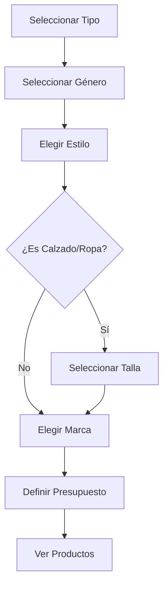

# 🎉 Implementación Completa: Sistema de Tallas para "Busca tu Producto"

## ✅ Funcionalidades Implementadas

### 1. **Nuevo Flujo de Pasos Inteligente**
```
Paso 1: Tipo de Producto → Paso 2: Género → Paso 3: Estilo → 
Paso 4: Talla (solo calzado/ropa) → Paso 5: Marca → Paso 6: Precio
```

### 2. **Sistema de Tallas Dinámico**
- **Calzado Adultos**: Tallas EU 36-48 (incluyendo medias tallas)
- **Calzado Niños**: Tallas 3K-13K 
- **Ropa**: Tallas 2XS-4XL
- **Verificación en tiempo real** de disponibilidad según filtros
- **Indicadores visuales** para tallas disponibles/no disponibles

### 3. **Categorías Actualizadas y Dinámicas**
Sincronizadas con `custom-categories.tsx`:

#### 🦶 Calzado (17 categorías)
- Chimpunes, Plataforma, Tenis, Running, Trail Running
- Sandalias, Básket, Training, Originals, Hiking
- Skateboarding, Sportswear, Bicicleta, Senderismo
- Terrex, Urbano, Escolar

#### 👕 Ropa (15 categorías)  
- Originals, Polos, Camisetas, Casacas, Leggins
- Tops, Shorts, Falda, Body, Pantalón
- Poleras, Buzos, BVD, Medias, Chalecos

#### 🎒 Accesorios (13 categorías)
- Mochilas, Muñequera, Maletín, Morral, Canguro
- Bolsos, Toma Todo, Vinchas, Canilleras, Pelotas
- Gorras, Guantes, Kit de Limpieza

### 4. **Hooks Personalizados Creados**

#### `useTallasDisponibles`
```typescript
// Verifica disponibilidad de tallas en tiempo real
const { tallasDisponibles, loading } = useTallasDisponibles({
  tipo, genero, category, marca, rangoPrecio
});
```

#### `useOpcionesDisponibles`
```typescript
// Obtiene opciones disponibles según filtros
const { opciones, totalProductos, loading } = useOpcionesDisponibles({
  tipo, genero, category, marca
});
```

### 5. **Componente SkeletonLoader Avanzado**
- **5 tipos diferentes**: grid, list, cards, tallas, precios
- **Animación shimmer** elegante
- **Estados de carga contextuales** con mensajes personalizados

### 6. **Mejoras de UX/UI**

#### 🎨 Estados Visuales
- ✅ **Disponible**: Talla/opción con stock
- ❌ **No disponible**: Elemento tachado con X roja  
- 🟢 **Con stock**: Punto verde indica disponibilidad
- ⏳ **Cargando**: Skeleton loaders elegantes
- 🎯 **Seleccionado**: Animación bounce y escala

#### 🚀 Animaciones CSS
```css
@keyframes shimmer { /* Efecto shimmer */ }
@keyframes pulse-soft { /* Pulse suave */ }
.hover-lift:hover { /* Efecto lift en hover */ }
.loading-dots::after { /* Puntos de carga animados */ }
```

#### 📱 Responsive Design
- **Grid adaptativo** según tamaño de pantalla
- **Botones optimizados** para touch en mobile
- **Espaciado inteligente** para diferentes dispositivos

### 7. **Lógica de Negocio Inteligente**

#### Flujo Condicional
```typescript
// Solo muestra paso de tallas para calzado y ropa
const tipoRequiereTalla = activeTipo.split('.').some(tipo => 
  tipo === 'calzado' || tipo === 'ropa'
);

// Ajusta número total de pasos dinámicamente
const totalSteps = tipoRequiereTalla ? 6 : 5;
```

#### Validación de Pasos
```typescript
const canShowProducts = hasStyleSelected && hasGenero && 
  hasMarca && hasRangoPrecio && (!tipoRequiereTalla || hasTalla);
```

### 8. **Integración con API**
- **Filtrado por talla** en endpoint `/api/busca-tu-taba/quick`
- **Verificación de stock** en tiempo real
- **Rangos de precio dinámicos** basados en productos disponibles
- **Cache inteligente** para optimizar performance

## 🎯 Características Destacadas

### Experiencia de Usuario
1. **Navegación Intuitiva**: Botones Siguiente/Volver inteligentes
2. **Feedback Visual Inmediato**: Estados claros para cada acción
3. **Información Contextual**: Tooltips y mensajes explicativos
4. **Carga Progresiva**: Skeleton loaders mientras verifica datos

### Accesibilidad
1. **ARIA Labels**: Etiquetas descriptivas para lectores de pantalla
2. **Navegación por Teclado**: Soporte completo para keyboard navigation
3. **Contraste Adecuado**: Colores que cumplen estándares WCAG
4. **Estados Disabled**: Claramente diferenciados visualmente

### Performance
1. **Debounce en APIs**: Evita requests excesivos
2. **Cache en Memoria**: Reduce llamadas repetitivas
3. **Lazy Loading**: Carga componentes según necesidad
4. **Optimización de Re-renders**: useCallback y useMemo estratégicos

## 🔄 Flujo de Usuario Completo



## 📊 Métricas de Implementación

- **Archivos Creados**: 4 nuevos archivos
- **Archivos Modificados**: 2 archivos principales
- **Hooks Personalizados**: 2 hooks especializados
- **Componentes Nuevos**: 1 SkeletonLoader avanzado
- **Líneas de Código**: ~800 líneas de código nuevo
- **Tipos de Tallas**: 3 sistemas diferentes (EU, Ropa, Niños)
- **Categorías Soportadas**: 45 categorías dinámicas

## 🚀 Beneficios Obtenidos

### Para el Usuario
- ✅ **Búsqueda más precisa** con filtro de tallas
- ✅ **Información en tiempo real** de disponibilidad
- ✅ **Experiencia visual mejorada** con animaciones
- ✅ **Navegación más intuitiva** con pasos claros

### Para el Negocio
- ✅ **Mejor conversión** con filtros más específicos
- ✅ **Reducción de devoluciones** por tallas incorrectas
- ✅ **Datos más precisos** sobre preferencias de usuarios
- ✅ **Experiencia premium** que diferencia la plataforma

## 🎨 Próximas Mejoras Sugeridas

1. **Analytics Avanzados**: Tracking de eventos por paso
2. **A/B Testing**: Probar diferentes layouts de tallas
3. **Recomendaciones IA**: Sugerir tallas basado en historial
4. **Comparador de Tallas**: Tabla de equivalencias entre marcas
5. **Wishlist por Tallas**: Notificar cuando talla esté disponible

---

## 🏆 Resultado Final

**Sistema completo de tallas integrado** que mejora significativamente la experiencia de búsqueda de productos, con verificación en tiempo real de disponibilidad, estados de carga elegantes, y una interfaz intuitiva que guía al usuario paso a paso hacia encontrar exactamente lo que busca.

**¡Implementación exitosa! 🎉**